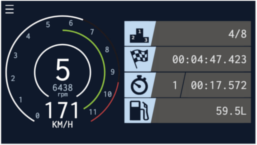
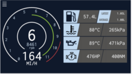

# Telemetry browsing for Project Cars 2
* [Source code](https://github.com/nabezokodaikon/pcars2-telemetry-browsing)
* [Change log](https://github.com/nabezokodaikon/pcars2-telemetry-browsing/doc/changelog.md)

## Overview
This application is a server that converts UDP data sent by PROJECT CARS 2 to HTTP.

By accessing this server with WebBrowser, you can browse the telemetry etc of PROJECT CARS 2.

This application can only be accessed within the same LAN as the UDP data being transmitted by PROJECT CARS 2.

## Screen shot
### SIMPLE View // TODO: Change to the DEFAULT View.

### MOTEC View // TODO: Change to the ENGINE View.

### TYRE View
TODO

### TIME View

### RANK View
TODO

## Dependencies
* Java Runtime Environment(JRE)

## Usage
### Settings
#### Application setting
* Edit the following items in `application.conf`
  * Change `ip-address` to the IP address of the PC running this application.
  * Change to the free port number of the PC that will run `port`.(Please change when it does not work with the default `9000`.)
#### PROJECT CARS 2 setting
1. Select `OPTIONS > SYSTEM`
1. Set as follows.
  * Shared Memory: No
  * UDP Frequency: 4 (Around 4 to 6 is appropriate.)
  * UDP Protocol Version: Project CARS 2

### iPhone or iPad Web page to Home short cut
* From the status bar of Safari, tap Add to Home Screen to create a shortcut on the home screen and display it in full screen.

## Install
* Expand `pcars2-telemetry-browsing.zip` file.

## Uninstall
* Delete `pcars2-telemetry-browsing` directory.

### Run
#### For Windows
* Please run `start-for-windows.bat` and access to the displayed address by WebBrowser of PC, smart phone or tablet in LAN.

## Troubleshooting
* If you can not connect to the server, check the PC's network interface.  
PROECT CARS2 connects to the network interface found at the beginning of the PC in the LAN.

## CREDITS
### PROJECT CARS 2
* <https://www.projectcarsgame.com/>
### Project CARS Official Forum 
* <http://forum.projectcarsgame.com/forum.php>
### CrewChief
* CrewChief <http://thecrewchief.org>
### scala
* Copyright (c) 2002-2017 EPFL
* Copyright (c) 2011-2017 Lightbend, Inc.
### akka
* Copyright (C) 2009-2017 Lightbend Inc. <http://www.lightbend.com>
### logback
* Copyright (C) 1999-2015, QOS.ch. All rights reserved.
### scala-logging
* Copyright 2014 Typesafe Inc. <http://www.typesafe.com>
### react
* Copyright (c) 2013-present, Facebook, Inc.
### redux
* Copyright (c) 2015-present Dan Abramov
### MapDB
* Apache LicenseVersion 2.0, January 2004
